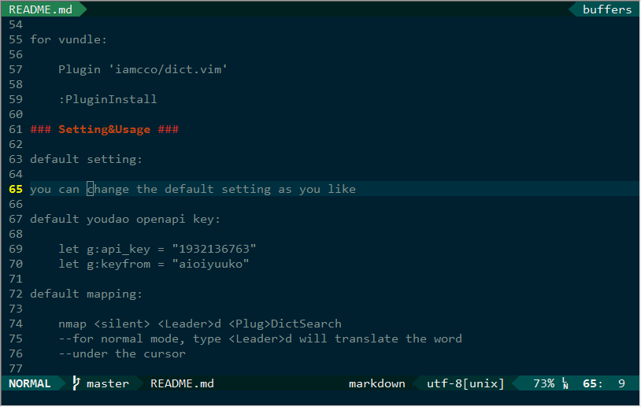
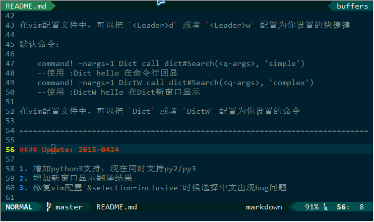

### 说明 ###

这个插件调用的是有道的openapi进行翻译的，需要vim支持python
并且使用的时候需要网络

### 安装 ###

通过 `:echo has('python')` 检查vim是否支持python。
最简单的安装方式就是使用vim插件管理器，比如 [vundle][vundle]

使用vundle安装：

    Plugin 'iamcco/dict.vim'

    :PluginInstall

### 使用和设置 ###

一下是默认的有道openapi的key：

    let g:api_key = "1932136763"
    let g:keyfrom = "aioiyuuko"

你可以设置成你自己申请的

默认快捷键绑定：

    nmap <silent> <Leader>d <Plug>DictSearch
    --普通模式下，<Leader>d 即可翻译光标下的文本，并在命令行回显

    vmap <silent> <Leader>d <Plug>DictVSearch
    --可视化模式下，<Leader>d 即可翻译选中的文本，并在命令行回显

    nmap <silent> <Plug>DictWSearch
    --普通模式下，<Leader>w 即可翻译光标下的文本，并且在Dict新窗口显示
    vmap <silent> <Plug>DictWVSearch
    --可视化模式下，<Leader>w 即可翻译选中的文本，并且在Dict新窗口显示

    nmap <silent> <Leader><Leader>r <Plug>DictRSearch
    --普通模式下，<Leader><Leader>r 即可翻译光标下的单词，并替换为翻译的结果

    vmap <silent> <Leader><Leader>r <Plug>DictRVSearch
    --可视化模式下，<Leader><Leader>r 即可翻译光标下的单词，并替换为翻译的结果

*Dict窗口中 `q` 键关闭Dict窗口*

在vim配置文件中，可以把 `<Leader>d`, `<Leader>w` 或者 `<Leader><Leader>r` 配置为你设置的快捷键

默认命令：

    command! -nargs=1 Dict call dict#Search(<q-args>, 'simple')
    --使用 :Dict hello 在命令行回显
    command! -nargs=1 DictW call dict#Search(<q-args>, 'complex')
    --使用 :DictW hello 在Dict新窗口显示

在vim配置文件中，可以把 `Dict` 或者 `DictW` 配置为你设置的命令

=============================================================================

#### Update: 2015-0424

1. 增加python3支持，现在同时支持py2/py3
2. 增加新窗口显示翻译结果
3. 修复vim配置`&selection=inclusive`时候选择中文出现bug问题

